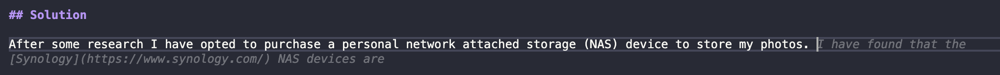

# ImageAI
An image (and movie) processor developed in [Visual Studio Code](https://code.visualstudio.com/) with the help of Artifical Intelligence (AI) tools such as [ChatGPT](https://chat.openai.com/) and [CodeGeeX](https://codegeex.cn/en-US)

## Problem

Generic cloud storage platforms such as [Google Drive](https://drive.google.com/) and [OneDrive](https://onedrive.live.com/) are great for storing and sharing files. However, they are not ideal for organizing photos. Image sharing platforms such as [SmugMug](https://www.smugmug.com/) and [Flickr](https://www.flickr.com/) cater more for professional photographers. However, they are expensive and not ideal for personal use. A user of Apple devices may find [iCloud](https://www.icloud.com/) convenient initially. However, they will eventually run out of space as even the top tier plan provides only 2TB. All of these platforms require users to compromise their privacy by sharing their photos with a third party.

## Solution

After some research I opted to purchase a personal network attached storage (NAS) device to store my photos. I have found that the [Synology](https://www.synology.com/) NAS devices are easy to use and have a great user interface. This device includes the [Synology Photos](https://www.synology.com/en-global/dsm/feature/photos) application which has some very useful features which results in total control and privacy for all my images.

The challenge remains how to rename, sort and deduplicate thousands of photos. I have opted to use a [Python](https://www.python.org) script to automate this process. Like many people I have photos from multiple devices over many years, film, digital cameras, social media, and ubiquitous mobile phones. The script will sort the photos into folders based on the date they were taken. It will also rename the photos to a standard format.

## Financial Analysis

The cost (in May 2023) for a Synology 2-bay DS220j and 2 x Seagate IronWolf 10TB disks was approx. USD$550 and yields ~9.1TB usable space using Synology Hybrid RAID (SHR)[https://kb.synology.com/vi-vn/DSM/tutorial/What_is_Synology_Hybrid_RAID_SHR]

In comparison to the cloud storage providers the table below shows approximiate annual cost for the services mentioned above

| Service            | Storage  | Annual Cost
| :----------------- | :------: | ------: |
| Google Drive       |   2 TB   | $80     |
| Microsoft 365      |   1 TB   | $50     | 
| SmugMug            |    ∞     | $121    |
| Flickr Pro         |    ∞     | $72     |
| Apple iCloud+      |   2 TB   | $132    |

It should be noted these platforms do provide other features besides storage, although in my experience other problems emerge if they are reach capacity. Even those offering "unlimited" storage can be slow to upload or download large batches of files and maybe time consuming to organise. A locally connected NAS device is fast and can be expanded as required.

## Artifical Intelligence

To begin I asked ChatGPT the following;

**Prompt:** What is the best file name format for thousands of photos?

**ChatGPT:** There are many different file naming formats that can work well for organizing thousands of photos. Here are a few common options:

Date-based file names: You can use a format that includes the date the photo was taken, such as "YYYY-MM-DD_filename.jpg". This can be helpful for sorting photos chronologically.
Sequential file names: You can use a format that includes a sequence number for each photo, such as "00001_filename.jpg", "00002_filename.jpg", and so on. This can be helpful for keeping track of the order in which photos were taken or processed.
Descriptive file names: You can use a format that includes a brief description of the photo, such as "beach_sunset_filename.jpg" or "family_vacation_001.jpg". This can be helpful for quickly identifying the contents of each photo.
Regardless of the format you choose, it's important to be consistent and use the same naming convention for all of your photos. This will make it easier to search for and find specific photos later on.

**Prompt:** I will choose a date-based file name format for my photos. How should I manage a conflict?

**ChatGPT:** If you are using a date-based file name format for your photos and encounter a conflict, such as two or more photos taken on the same day, you can add a suffix to differentiate between them.

One approach is to add a time stamp to the file name, such as "YYYY-MM-DD_HHMMSS_filename.jpg". This will create a unique file name for each photo, based on the precise time it was taken.

For example, if you have two photos taken on January 1st, 2023, you could name them "2023-01-01_121500_filename.jpg" and "2023-01-01_140200_filename.jpg" to reflect the time they were taken.

Another approach is to add a letter or number suffix, such as "YYYY-MM-DD_filename-a.jpg" and "YYYY-MM-DD_filename-b.jpg". This can work well if you only have a few conflicting photos.

**Prompt:** Can you crate a python script which can be used to perform this?

**ChatGPT:** Yes, I can help you create a Python script to perform the file naming using the date-based format you've chosen. Here's an example script that renames all `.jpg` files in a directory to use the format `YYYY-MM-DD_filename.jpg`:

```python
import os
import datetime

# Set the directory where your photos are located
directory = "/path/to/photos"

# Loop through all files in the directory
for filename in os.listdir(directory):
    if filename.endswith(".jpg"):
        
        # Get the creation time of the file
        timestamp = os.path.getctime(os.path.join(directory, filename))
        date = datetime.datetime.fromtimestamp(timestamp).strftime('%Y-%m-%d')
        
        # Construct the new file name
        new_filename = f"{date}_{filename}"
        
        # Rename the file
        os.rename(os.path.join(directory, filename), os.path.join(directory, new_filename))
```

In this script, the `os` module is used to access and manipulate files and directories, and the `datetime` module is used to format the date from the file's creation timestamp.

You can modify the script to adjust the file name format or directory path to suit your needs. Additionally, you may want to add error handling or confirmation prompts to ensure that the script renames files correctly and safely.

AI is also helping to write the document you are now reading!



## Functions

- Build an index database for all files in the photo library folder
- Iterate through a source directory and rename to the desired format
- Handle duplicate filename by appending a suffix
- Move files to a destination directory for further processing
- Compare image metadata to detect and remove duplicates

## Naming Convention

Synology Photos creates the following folder structure and can automatically sort images into the year and month the photo was taken. If the image has no EXIF data it will use the file creation date instead.

    PhotoLibrary
    ├── YYYY
    │   ├── MM
    │   ├── MM
    │   └── ...
    ├── YYYY
    │   ├── MM
    │   ├── MM
    │   └── ...
    └── ...

The script renames files to the following convention, with an optional suffix if there is a conflict

    YYYYY-MM-DD_HHMMSS.JPG

## Usage

